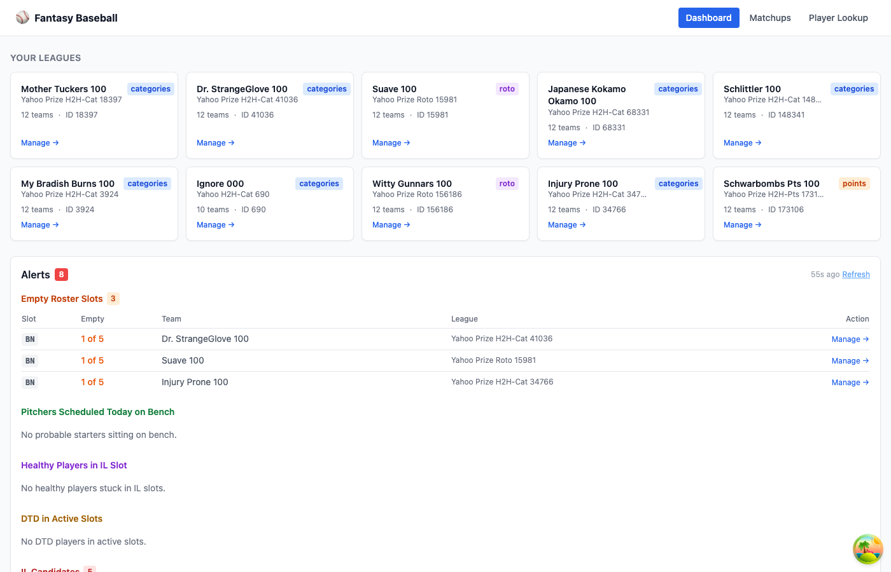
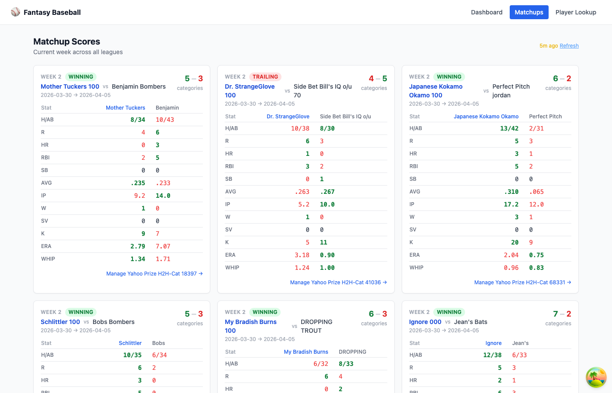
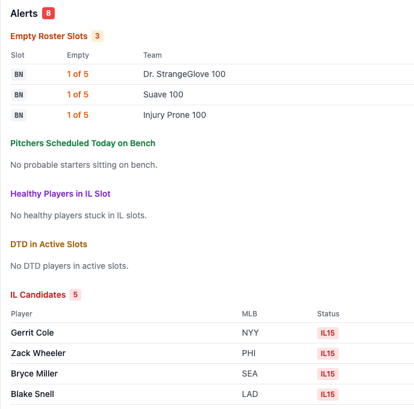
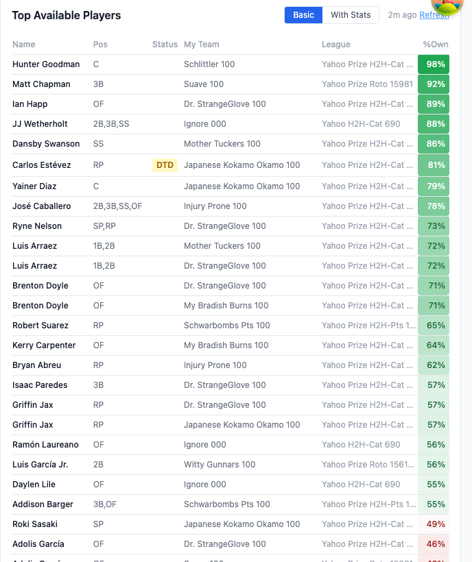
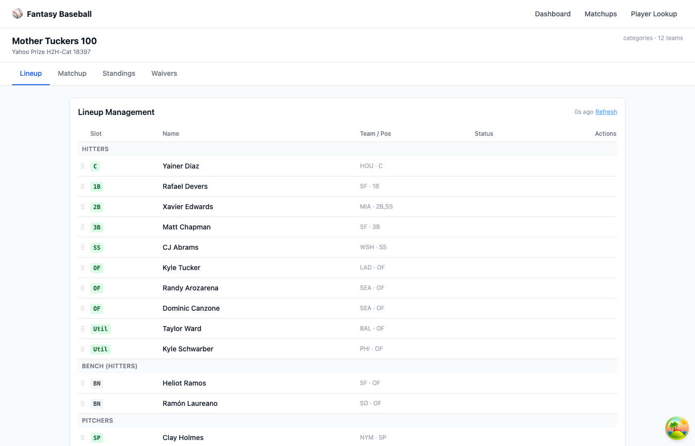
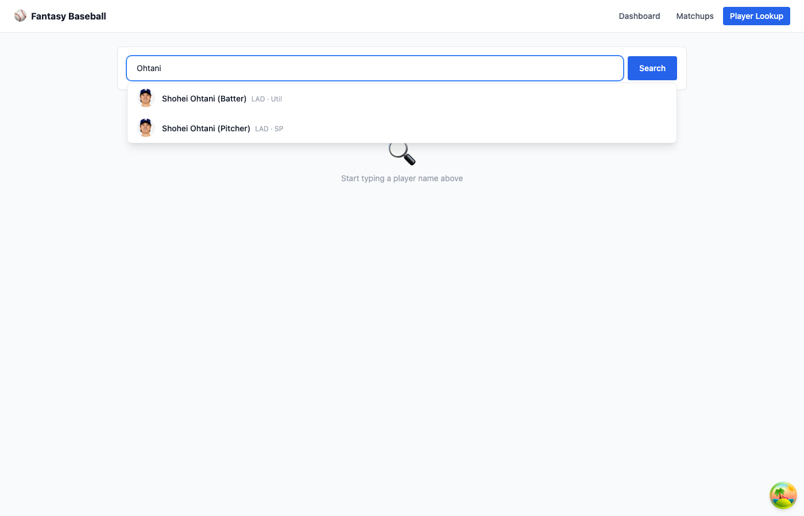

# Fantasy Baseball Control Panel

A full-stack fantasy baseball platform combining MLB data pipelines, multi-system projections, breakout prediction (ML), and a live web app for managing multiple Yahoo Fantasy leagues simultaneously.

---

## Web App

A React + FastAPI control panel for managing all Yahoo leagues in one place. Run both servers and open `http://localhost:5173`.

```bash
bash webapp/start-backend.sh   # FastAPI on :8000
bash webapp/start-frontend.sh  # Vite/React on :5173
```

### Dashboard

Multi-league overview with smart roster alerts — empty slots, probable starters sitting on bench, IL overflow, DTD in active slots, and upgrade suggestions.



### Matchup Scores

Current-week stat-by-stat breakdown across every league at a glance. Green = winning that category, red = losing.



### Roster Alerts

Automatically flags actionable roster issues across all leagues: empty slots, probable starters sitting on bench, healthy players wasting IL slots, day-to-day players in active slots, and IL candidates.



### Top Available Players

Top waiver wire targets ranked by ownership %, filtered to 45%+ owned players. Toggle between basic and full season stats view.



### League Management

Per-league tabbed view: **Lineup** (slot management), **Matchup** (head-to-head stats), **Standings**, and **Waivers** (free agents + projections).



### Player Lookup

Typeahead search with full player profile — season stats, 3-year history, 6-projection-system comparison, and availability across all your leagues.



---

## Data & Analysis (Notebooks)

> **Start with** [`notebooks/draft_research.ipynb`](notebooks/draft_research.ipynb) for rankings methodology, then [`notebooks/breakouts.ipynb`](notebooks/breakouts.ipynb) for the ML work.

### [`draft_research.ipynb`](notebooks/draft_research.ipynb) — Draft Rankings & Value
- Player rankings across all three Yahoo scoring formats (points, categories, roto) using z-score normalization with playing-time-weighted rate stats
- Multi-system projections — Steamer, ZiPS, ATC, The BAT, Depth Charts fetched from the FanGraphs API
- **Draft value:** projected fantasy rank vs. Yahoo ADP to surface undervalued picks
- Power/speed target screens: 20/20 candidates, high-average hitters

### [`breakouts.ipynb`](notebooks/breakouts.ipynb) — Breakout Prediction (ML)
- **Breakout definition:** ≥2.0 WAR jump YoY, sustained the following season (no data leakage)
- K-Means clustering on 2015–2024 historical breakouts to identify archetypes (exit-velocity improvers, walk-rate improvers, etc.)
- Decision Tree classifier trained on labeled breakout/non-breakout players
- PCA cluster visualization; cross-validated via `StratifiedKFold`
- Outputs ranked 2025 breakout candidates with archetype assignments

### [`yahoo_fantasy_baseball.ipynb`](notebooks/yahoo_fantasy_baseball.ipynb) — Multi-League Dashboard
- All-league roster grid across all 10 active leagues
- Top available players per league; upgrade candidates vs. current roster
- Waiver queries, add/drop/trade/lineup moves via live Yahoo API

### [`team_management.ipynb`](notebooks/team_management.ipynb) — Single-League Operations
- Focused notebook for one league: roster, matchup, waivers, lineup moves

---

## Architecture

```
baseball/
├── baseball.py          # Data layer — FanGraphs + Statcast pipeline
│                        #   Batters, Pitchers, Teams, League, Fantasy
├── yahoo.py             # Yahoo Fantasy API client
│                        #   Yahoo class + aggregation helpers (all_rosters,
│                        #   upgrade_candidates, benched_starters, all_matchup_scores…)
├── woba_weights.py      # wOBA linear weights by season
├── advisor.py           # Trade advisor utilities
│
├── webapp/
│   ├── backend/         # FastAPI — routers: dashboard, league, players
│   └── frontend/        # React + Tailwind + TanStack Query
│
└── notebooks/
    ├── draft_research.ipynb
    ├── breakouts.ipynb
    ├── yahoo_fantasy_baseball.ipynb
    ├── team_management.ipynb
    └── _retrievers.ipynb
```

### Backend API Endpoints

| Router | Endpoints |
|---|---|
| **Dashboard** | `/leagues`, `/dashboard/rosters`, `/dashboard/alerts` (empty slots, benched starters, IL/DTD), `/dashboard/top-available`, `/dashboard/upgrades`, `/dashboard/matchup-scores` |
| **League** | `/{id}/roster`, `/{id}/matchup`, `/{id}/standings`, `/{id}/waivers`, `/{id}/free-agents`, `/{id}/search`, `/{id}/adp` |
| **League (write)** | `/{id}/add`, `/{id}/drop`, `/{id}/trade`, `/{id}/move`, `/{id}/bench`, `/{id}/start`, `/{id}/il`, `/{id}/swap` |
| **Players** | `/players/autocomplete`, `/players/lookup` |

All endpoints support `?refresh=true` to bypass the TTL cache.

---

## Key Technical Details

| Area | Implementation |
|---|---|
| Player valuation | Z-score normalization; playing-time-weighted AVG/ERA/WHIP across 1,000+ players |
| Projections | FanGraphs JSON API — 8 systems (Steamer, ZiPS, ATC, The BAT, Depth Charts…) |
| ML breakout model | Scikit-learn: K-Means + PCA for archetypes; Decision Tree with StratifiedKFold CV |
| Yahoo API | OAuth 2.0 PKCE with auto-refresh on every call; paginated waiver/roster endpoints |
| Caching | In-memory TTL cache (5–60 min per endpoint); `?refresh=true` to force-fetch |
| Data sources | FanGraphs (stats + projections), Baseball Savant/Statcast, MLB Stats API, Yahoo Fantasy |

---

## Setup

**Python env:** `conda activate venv` (pybaseball, pandas, numpy, scikit-learn, yahoo-oauth, FastAPI, uvicorn)

**Yahoo OAuth:** On first use, run `init_auth()` in `yahoo_fantasy_baseball.ipynb`. Tokens are saved to `yahoo_oauth.json` and auto-refreshed — no repeated browser login.

```python
# Quick data export
from baseball import League
League(2025).fetch().export_csv('top_300_fantasy_2025.csv')

# Yahoo API
from yahoo import Yahoo
y = Yahoo(league_id='12345').fetch()
print(y.roster)
```
